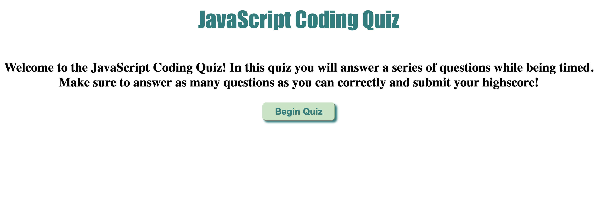

# JavaScript Coding Quiz
#### Daniel Hernandez
 

## Technologies Used
<ul>
    <li>HTML</li>
    <li>CSS</li>
    <li>Javascript</derli>
</ul>    

 

## Description
This website hosts a quiz that can test novice web developers on their knowledge of basic code. Clicking on the correct answer will prompt an alert that will either tell the user they were correct in their choice or were wrong. Also included, there is a timer that will force users to choose an answer or else it will restart the quiz.

 

## Installation
 

https://danalexanderh.github.io/javascript-quiz/

 

## Usage
Beginner programmers can use this quiz to brush up on their coding knowledge by selecting the correct answers to the question and in return, will get a highscore.
   

